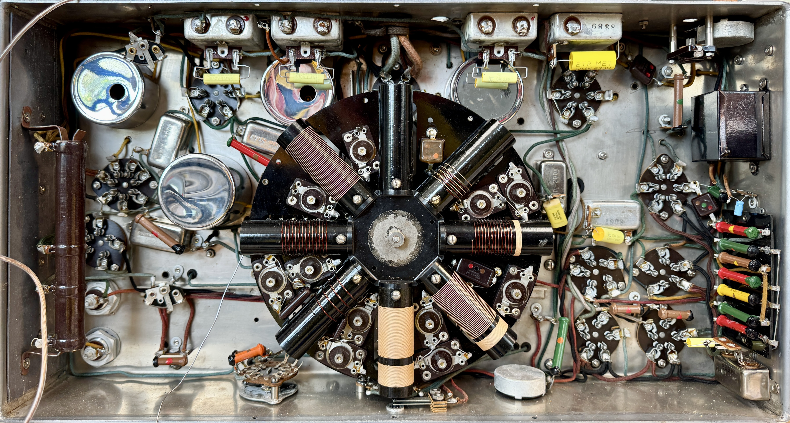
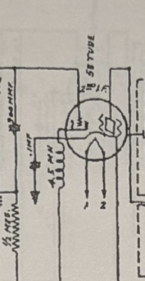
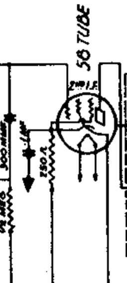
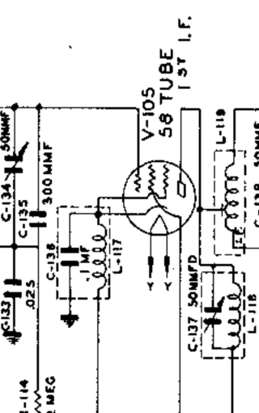
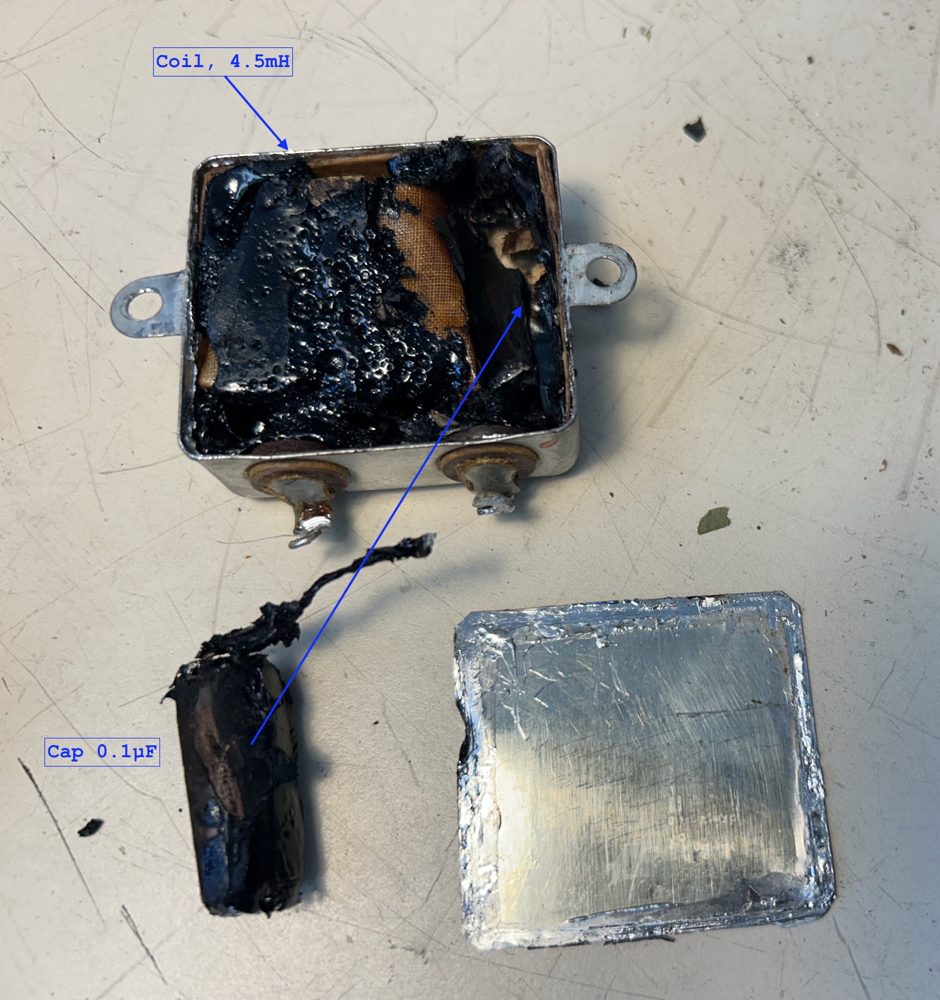
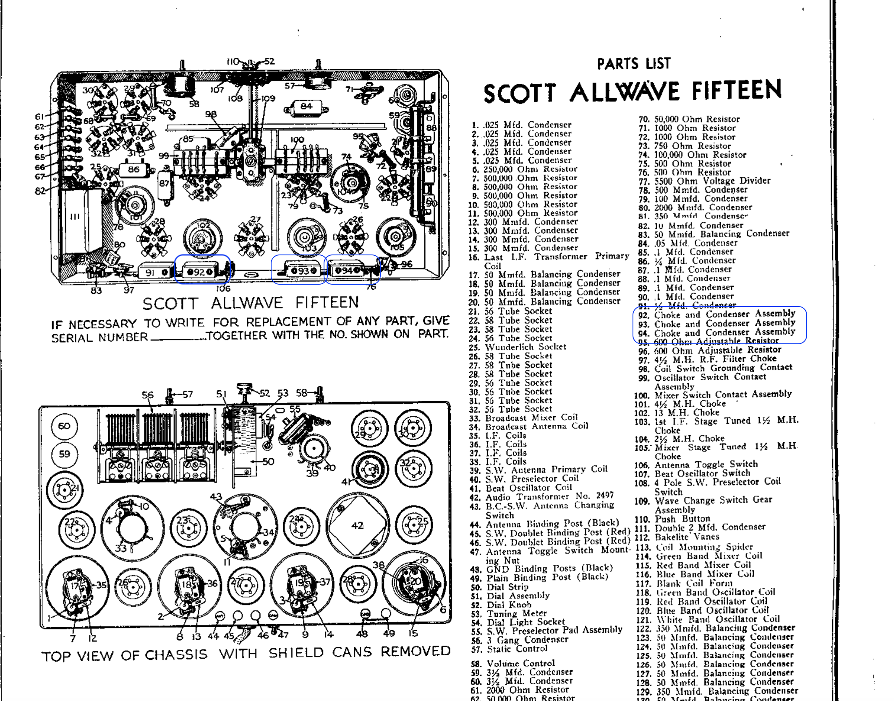

# Scott Lido Console AW15 Chassis — 1932 — Bathtub Capacitor

## Summary

- Device: Scott Lido Console (1932)
- Chassis: AW15
- Component: Bathtub capacitor with internal inductor
- Inductor value: 4.5 mH (internal, not labeled)
- Function: Cathode bypass / bias network in IF amplifier stage
- Key feature: Capacitor can includes hidden choke (inductor)
- Sources: Rider manual and EH Scott forum

---

## Overview

This document describes the bathtub capacitors used in the Scott Lido Console (1932) with an AW15 chassis.

These bathtub capacitors include internal inductors (chokes) that are not indicated on the component labeling but are part of the IF amplifier cathode circuit.

---

## Schematic References

- **EH Scott forum (Kent King):**  
  [Allwave-15 variations](https://ehscott.ning.com/forum/topics/allwave-15-variations-2)

- **Rider manual:**  
  [Allwave-15 variations](https://www.nostalgiaair.org/pdfs/Scott-Radio-Labs-Inc/Scott-Radio-Labs-Inc-All-Wave-15.pdf)
---

## Component: Bathtub Capacitor (IF Section)

### Description

The bathtub capacitor is used in the IF (Intermediate Frequency) section of the AW15 chassis.

These bathtub capacitors are connected to the cathode of the IF amplifier tubes and form part of the cathode bias and bypass network.

---

### Physical Location

Three bathtub capacitors are visible at the top of the chassis (recapped):

---

### Electrical Function

The bathtub capacitors function as part of the IF amplifier cathode bypass and bias network.

Different AW15 variants use different cathode configurations:

- Capacitor + bias resistor
- Capacitor + internal inductor 

---

### Schematic Reference

Schematic variants of the IF section showing different cathode bypass implementations:

  
  

---

### Internal Inductor (Hidden Choke)

In variants using a cathode choke, the bathtub capacitor contains an internal inductor.

- Inductor value: 4.5 mH
- Location: Inside the bathtub capacitor can
- Visibility: Not externally labeled
- Function: Acts as a choke in the cathode circuit of the IF amplifier

---

### Documentation Notes

In the Rider manual, this component is described as:

> "Choke and condenser assembly"

The capacitor case is labeled only as:

- 1/10 µF (0.1 µF)

The internal 4.5 mH inductor (choke) is not documented on the component case.

---

## Key Observations

- The bathtub capacitor combines capacitance (0.1 µF) and inductance (4.5 mH)
- The internal inductor functions as a cathode choke in the IF amplifier
- The inductor is not externally labeled, making it easy to overlook
- Different AW15 variants use different cathode bias and bypass designs
- The component may appear to be a simple capacitor but is a combined LC element

---

[Back to home](../)